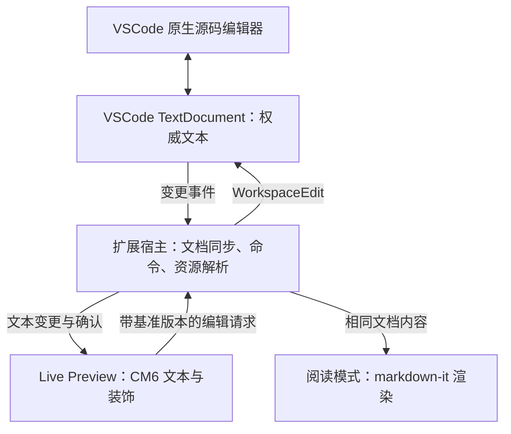

# Obsidian 技术栈与 VSCode Markdown 编辑器初步方案

调研日期：2026-09-23。状态：研究与建议，尚未批准实施。三项并行调研均使用 `gpt-6-sol`。

用户已明确产品目标：**Obsidian 风格 Live Preview 与阅读模式可切换**。本报告不将全程隐藏 Markdown 标记的富文本编辑器作为目标。

## 1. 结论

建议采用 **VSCode CustomTextEditorProvider + Webview + CodeMirror 6**：在实时预览中直接编辑 Markdown 文本，通过显示层隐藏标记、呈现格式；阅读模式从同一文本生成只读视图。

这是一条技术上可行、但编辑细节投入较高的路线。首个原型应先证明中文输入、撤销重做、外部变更同步和模式切换可靠，再扩大语法覆盖。此判断来自官方 API 能力与下述工程风险，不是已运行原型后的验证结果。[VSCode 官方入口](https://code.visualstudio.com/api/extension-guides/custom-editors)、[Obsidian 编辑器扩展文档](https://github.com/obsidianmd/obsidian-developer-docs/blob/main/en/Plugins/Editor/Editor%20extensions.md)

建议的质量底线是：**没有编辑的文本不被格式化重写，无法识别的语法仍保留原文**。这里指文本保真；编码、BOM、CRLF/LF、保存时格式化等属于宿主文件链路，必须另行测试，不能仅因采用 CM6 就声称字节级无损。

## 2. Obsidian 的技术栈：证据与边界

| 层次 | 已核实的事实 | 对本项目的意义 |
| --- | --- | --- |
| 桌面宿主 | 官方更新文档说明 Obsidian 使用 Electron。[来源](https://obsidian.md/help/updates) | 插件运行于 VSCode，不需要另带 Electron |
| 移动平台 | 官方说明移动端不能使用 Node.js/Electron API；致谢列有 Capacitor。仅凭致谢不足以完整确定移动端架构。[移动开发](https://docs.obsidian.md/Plugins/Getting%20started/Mobile%20development)、[致谢](https://obsidian.md/help/credits) | 本期目标是 VSCode 桌面；不照搬 Obsidian 的平台适配层 |
| 插件开发 | 官方示例采用 TypeScript，编译为 JavaScript；公开的 obsidian-api 是 API 类型定义。[示例](https://github.com/obsidianmd/obsidian-sample-plugin)、[API](https://github.com/obsidianmd/obsidian-api) | 可参考扩展接口设计，不能推断整个 Obsidian 都以同一技术实现 |
| 编辑内核 | 官方明确 Markdown 编辑器使用 CodeMirror 6，Live Preview 外观扩展通过 editor extension 实现。[来源](https://github.com/obsidianmd/obsidian-developer-docs/blob/main/en/Plugins/Editor/Editor%20extensions.md) | CM6 是贴近目标交互的候选内核 |
| 扩展显示 | 官方示例使用语法树、Decoration、WidgetType 改变显示。[来源](https://docs.obsidian.md/Plugins/Editor/Decorations) | 可基于公开机制独立实现；不能证明内建功能逐项采用相同实现 |
| 数据存储 | 笔记是本地 Markdown 纯文本；元数据缓存服务于索引，不能把缓存等同笔记本体。[来源](https://obsidian.md/help/data-storage) | 本期保持普通 `.md` 文件，不引入私有文档格式 |
| 核心源码 | 官方发布仓库明确应用不是开源软件，也不提供核心源码。[来源](https://github.com/obsidianmd/obsidian-releases) | 内部解析器配置、完整依赖、光标算法、UI 框架未得到确认 |

**Live Preview 与阅读模式不同**：前者允许编辑，光标进入格式化内容时显露相关 Markdown 语法；后者隐藏语法以供阅读。Obsidian 还提供显示全部标记的 Source mode。以上是公开行为契约，不是对闭源实现的数据流断言。[官方视图说明](https://obsidian.md/help/edit-and-read)

Obsidian 的格式扩展包括 wikilink、嵌入、块引用、高亮、注释和 callout 等。官方称其支持 CommonMark、GFM 和 LaTeX，但这不能作为所有边界语法与其他实现完全相同的保证。例如官方明确 HTML 元素内部不继续解析 Markdown。[官方格式说明](https://github.com/obsidianmd/obsidian-help/blob/master/en/Editing%20and%20formatting/Obsidian%20Flavored%20Markdown.md)

## 3. 编辑内核选型

以下评价是针对本项目目标的工程判断；“可导入导出 Markdown”不等于保留原始拼写、空白和未知语法。

| 路线 | 官方可确认的机制 | 评估 |
| --- | --- | --- |
| CodeMirror 6 | 文本状态、事务和视图装饰；Markdown 语言支持可扩展。[指南](https://codemirror.net/docs/guide/)、[API](https://codemirror.net/docs/ref/)、[语言包](https://github.com/codemirror/lang-markdown) | **首选**。未识别语法仍可作为文本存在；实时预览交互需要自行实现 |
| Milkdown / ProseMirror | 基于 ProseMirror 与 Remark，提供 Markdown 与结构化文档之间的转换。[介绍](https://milkdown.dev/docs/guide/why-milkdown)、[转换器](https://milkdown.dev/docs/api/transformer) | 适合结构化富文本；本项目需额外证明原文往返保真，不作为首选 |
| Tiptap Markdown | Markdown 与 Tiptap JSON 转换，可定制解析和序列化；所查文档标为 Beta。[官方文档](https://tiptap.dev/docs/editor/markdown) | 若以后转向全程富文本再评估；当前目标不需要承担转换模型成本 |
| Vditor | 提供 WYSIWYG、即时渲染、分屏三种模式，集成较多功能。[官方 README](https://github.com/Vanessa219/vditor/blob/master/README_en_US.md) | 可做快速体验对照；原文保真、wikilink 和深度光标行为需实测，不能直接等同 Obsidian |

上述项目的开源核心均提供 MIT 许可；具体打包版本、扩展、依赖与附属资产仍须实施时逐项核对。[CM6](https://github.com/codemirror/lang-markdown/blob/main/LICENSE)、[Milkdown](https://github.com/Milkdown/milkdown)、[Tiptap](https://github.com/ueberdosis/tiptap)、[Vditor](https://github.com/Vanessa219/vditor)

阅读渲染建议先选 **markdown-it**。其官方支持可配置规则与语法插件，但 Obsidian 专有语法不能默认视为已经覆盖。[官方说明](https://github.com/markdown-it/markdown-it)

**CM6 与 markdown-it 不共享同一解析器**。建议共享语法开关、链接解析规则、资源解析和测试样例；分别为编辑与阅读实现适配。不要为了“统一 AST”过早重写整套解析器，也不要容忍两种视图对相同语法给出不同含义。

## 4. 建议架构

### 4.1 宿主与持久化

使用 `CustomTextEditorProvider`，不选择自行管理文件模型的 `CustomEditorProvider`。官方为前者提供标准文本的保存与备份支持；扩展仍负责 Webview 与 `TextDocument` 的双向同步。初期将 custom editor 注册为 `priority: option`，供用户通过 Reopen With 选择。[官方说明](https://code.visualstudio.com/api/extension-guides/custom-editors)

建议将扩展内职责分为：文档同步、编辑视图、阅读渲染、语法规则、工作区链接/资源。它们是逻辑边界，本轮不创建空模块，也不确定最终目录结构。

### 4.2 文档同步：先解决数据正确性

建议协议包含 `documentUri`、`viewId`、`transactionId`、`baseVersion` 与增量文本修改。CM6 可以先本地回显，但 Webview 文本只是暂时副本，确认后的 `TextDocument` 才是权威版本。

宿主按文档串行处理请求，检查基准版本和范围，应用最小文本编辑。接收 `onDidChangeTextDocument` 后同步视图，区分本地确认与外部修改，避免重复应用。`TextDocument.version` 可作为版本标记，但 `WorkspaceEdit` 本身不是自动解决并发冲突的协议。[API 契约](https://code.visualstudio.com/api/references/vscode-api#TextDocument)、[变更事件](https://code.visualstudio.com/api/references/vscode-api#TextDocumentChangeEvent)、[applyEdit](https://code.visualstudio.com/api/references/vscode-api#workspace.applyEdit)

**过期修改不能直接覆盖最新内容**。原型需实现或验证：待确认输入队列、可安全重定位置的修改、无法重定位置时保留未确认内容并重新同步。仅“检查版本后应用”仍有异步竞态，需用原生编辑器或其他扩展同时写入的测试覆盖。

撤销重做建议以宿主文本历史为准，不同时维护两个独立的权威历史。CM6 默认历史、Webview 快捷键、VSCode Undo/Redo 命令的路由与编辑分组需要原型实测；官方提供文本撤销模型不等于端到端体验自动完成。[官方同步与撤销说明](https://code.visualstudio.com/api/extension-guides/custom-editors)

### 4.3 Live Preview

建议用语法树识别范围，样式装饰呈现标题与强调，用替换装饰隐藏非活动标记，用 widget 显示图片等内容。编辑中的语法区域恢复源码，跨区域选择、组合输入期间避免激进重建 DOM。CM6 的语法树可能只完成部分解析，须允许暂时退回原文显示。[装饰机制](https://codemirror.net/docs/guide/#decorating-the-document)、[syntaxTree](https://codemirror.net/docs/ref/#language.syntaxTree)

不要以全篇正则替换实现完整实时预览：嵌套语法、转义、代码块和不完整输入会使显示范围难以可靠维护。正则仅适合已有语法边界内的局部辅助逻辑。此为工程建议。

### 4.4 阅读模式与切换

建议两种模式位于同一 WebviewPanel，保持相同未保存文本；切换是 UI 状态变化，不触发保存、不生成编辑历史。阅读模式先作为只读视图，仍接收外部文本更新。

记录源码 offset/行号作为定位锚点，阅读 DOM 关联源范围；切换时回到对应段落，再恢复编辑光标。使用锚点而非滚动百分比，应对图片加载和两种布局高度不同。精确程度需验证，第一版可明确保证段落级定位。

每个视图分别保存模式、选择和滚动锚点；隐藏后恢复时重新校准文档版本。Webview 提供 `getState/setState` 保存轻量 UI 状态，不能将它当作文本持久化替代。[官方状态恢复](https://code.visualstudio.com/api/extension-guides/webview#persistence)

工具栏按钮与命令面板均提供模式切换。快捷键限定在本插件激活上下文，不直接全局覆盖 Obsidian 的按键。源码入口可通过 `vscode.openWith` 打开原生编辑器。[内置命令](https://code.visualstudio.com/api/references/commands#built-in-commands)

### 4.5 VSCode 能力边界

Webview 不等于原生 TextEditor。查找替换、多光标、补全、诊断、代码操作与其他扩展的编辑器交互不能假定自动继承。`enableFindWidget` 只是 Webview 查找控件，源码查找替换仍需另行设计。[WebviewPanelOptions](https://code.visualstudio.com/api/references/vscode-api#WebviewPanelOptions)

自有阅读视图也不会自动继承 VSCode 内置 Markdown 预览的插件。内置预览有专门的 `markdown.markdownItPlugins` 扩展入口；本方案需要自己确定支持哪些语法插件。[官方 Markdown 扩展文档](https://code.visualstudio.com/api/extension-guides/markdown-extension)

原生 decorations 适合文本样式与有限附加显示；对于可交互表格、图片块和复杂布局，本报告选择 Webview。不能把 CM6 的 Widget API 当成 VSCode TextEditor API。[VSCode 装饰 API](https://code.visualstudio.com/api/references/vscode-api#DecorationRenderOptions)

资源通过 URI 解析并由 `asWebviewUri` 转换，设置 CSP 与受限的 `localResourceRoots`。首期禁用 Markdown 原始 HTML 的主动内容，外部资源显式处理；消息必须检查类型、目标文档、范围与 URI。CSP 不能替代内容过滤。[官方 Webview 安全说明](https://code.visualstudio.com/api/extension-guides/webview#security)

远程工作区的 Webview 与扩展宿主可能不在同一机器，不能依赖 localhost 或本地绝对路径。浏览器版扩展还需要 `browser` 入口并避免 Node API。因此建议先验证桌面本地，再分别验证 Remote SSH 和 Web，不把它们视作自动兼容。[远程指南](https://code.visualstudio.com/api/advanced-topics/remote-extensions#using-the-webview-api)、[Web 扩展](https://code.visualstudio.com/api/extension-guides/web-extensions)

## 5. 建议功能范围

| 阶段 | 功能 | 预期边界 |
| --- | --- | --- |
| 可验证原型 | 普通文本、标题、强调、行内代码；两种模式；保存和源码入口 | 重点验证同步与交互，不追求语法齐全 |
| 首个可用版本 | 引用、列表、任务、代码块、链接、本地图片；查找；主题适配 | YAML frontmatter、未知语法原样保留；表格先显示，编辑时退回源码块 |
| Obsidian 语法扩展 | wikilink、标题锚点、高亮、callout、数学和嵌入 | 按独立样例逐项交付；链接重命名传播、块引用和嵌入循环单独设计 |
| 后续体验完善 | 表格单元格编辑、图片粘贴、Mermaid、键盘无障碍优化 | 不提前承诺与 Obsidian 所有行为完全一致 |

首期建议不包含关系图谱、双链侧栏、Obsidian 插件兼容层、Sync、Canvas 或整个 vault 的管理。这是范围建议，尚不是用户确认的排除清单。

wikilink 的实现前必须确定工作区根、相对路径、重复文件名、别名和不存在目标的处理方式；只识别 `[[文字]]` 不等于完成 Obsidian 链接语义。

## 6. 实施顺序与退出条件

以下是后续实施计划，不代表本轮已经实施。每阶段先写契约测试，确认能暴露目标问题，再实现；中文输入、拖选和视觉表现仍需真实 VSCode 宿主人工检查。

| 阶段 | 交付物 | 必须通过的验证 |
| --- | --- | --- |
| P0：样例与契约 | 固定语法样例、模式规则、文本同步协议草案；锁定依赖版本和最低 VSCode 版本 | 明确未编辑文本保真定义；已定义外部变更、模式切换、冲突行为 |
| P1：宿主原型 | CM6 输入、TextDocument 增量同步、保存、双模式最小视图 | 中文连续输入、undo/redo、未保存内容切换、源码侧修改、隐藏恢复均不丢字 |
| P2：基础实时预览 | 标题、强调、代码、列表等显示与编辑规则 | 光标进入/离开、边界退格、跨块选择、复制粘贴、未闭合语法稳定 |
| P3：阅读与首版整合 | 一致渲染、源位置锚点、链接图片、主题、键盘操作 | 两种视图语义一致；连续切换不改文档、不污染历史；资源离线可用 |
| P4：Obsidian 扩展与打包 | 逐项添加专有语法、VSIX、文档与依赖清单 | 完整回归；扩展开发宿主及安装 VSIX 两条运行路径均验证 |

**P1 是继续投入的决策点**：若同步、输入法或撤销无法达到可靠标准，先缩减并发编辑范围或调整协议，不用更多视觉功能掩盖数据问题。

### 最低测试矩阵

- 文本保真：CRLF/LF、BOM、尾部空格、文件末尾换行、引用式链接、混合 HTML、frontmatter、未知语法；无编辑打开/切换/关闭不引入文本变化。
- 输入：中文拼音组合、候选确认/取消、emoji 与 UTF-16 范围、跨行粘贴、快速连续输入与退格；组合输入时注入外部修改。
- 宿主：保存/自动保存、撤销/重做、外部磁盘更新、原生编辑器修改、多视图修改、关闭重开、隐藏恢复、applyEdit 失败。
- 模式：未保存内容切换、图片加载改变高度、阅读时外部更新、恢复光标、模式切换不进入撤销历史。
- 安全：危险 HTML/链接、资源越界、伪造消息、非工作区 URI、禁网情况下打开；由策略明确允许的链接才执行对应动作。
- 性能：约 10 KB、100 KB、1 MB 及图片密集样例；测量首次打开、输入延迟、滚动和模式切换。数字是测试档位，不是已验证能力或性能承诺。

目前不提供确定工期。P1 结束后按实测瓶颈估算首版投入，比把“编辑器可显示”当成“编辑器已可靠”更有依据。

## 7. 已完成与尚未验证

本轮完成官方资料核对、三条并行调研、路线比较和实施顺序设计。仓库仍无 `package.json`、运行代码或测试环境，因此未进行 API 编译验证、性能基准、中文输入实测或 VSIX 验证；也未锁定依赖版本。

尚需在原型前明确：首版语法优先级、阅读模式是否允许勾选任务、是否首版支持远程工作区、多视图并发编辑的保证范围。默认建议是桌面本地工作区优先、阅读模式只读，接口设计保留 URI 支持。

Obsidian 核心 UI 框架、内建实时预览具体实现和完整依赖版本均未核实；本方案不依赖这些未知信息，也不承诺兼容 Obsidian 社区插件。
